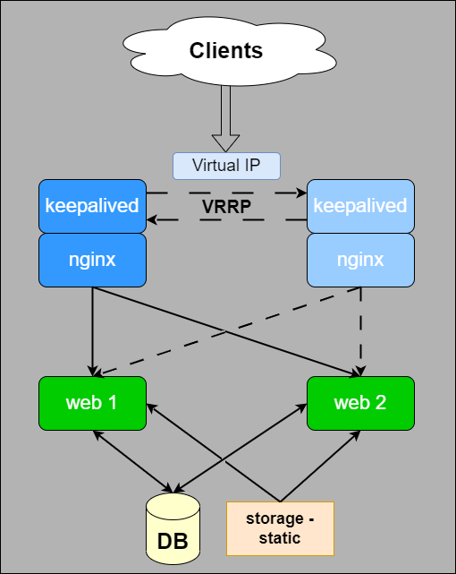

# keep_gnix

ДЗ 4 - настройка конфигурации веб приложения под высокую нагрузку.

* Работу выполнили [Александр](https://github.com/NexusPolarius) и [Александр](https://github.com/piragunka)

Схема:

