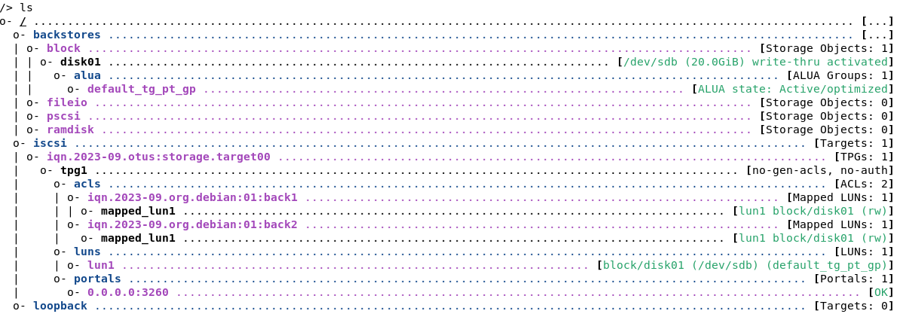
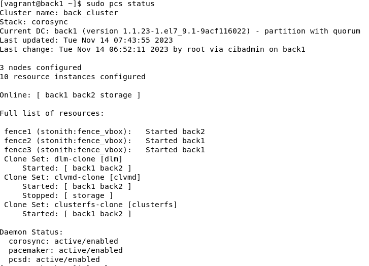
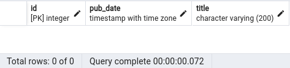
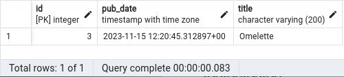
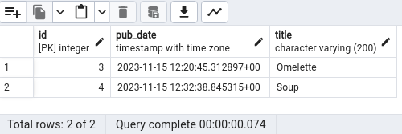
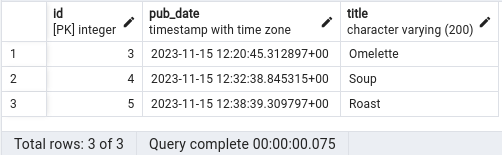

# keep_gnix

## ДЗ 4 - настройка конфигурации веб приложения под высокую нагрузку.

### Работу выполнили:
* [NexusPolarius](https://github.com/NexusPolarius)
* [piragunka](https://github.com/piragunka)

## На вашей выполняющей машине должны быть выполнены следующие действия:
* установить virtualbox 6.1
* установить vagrant (при необходимости настроить прокси сервер для работы vagrant)
* установить ansible
* скачать vagrant box https://cloud.centos.org/centos/7/vagrant/x86_64/images/CentOS-7-x86_64-Vagrant-2004_01.VirtualBox.box
* выполнить команду vagrant box add cent7 <путь до скаченного бокса>
* выполнить команду "git clone https://github.com/NexusPolarius/keep_gnix.git"
* выполнить настройку параметров в файлах переменных, расположенных в /keep_gnix/ansible/group_vars
* переименовать файл temp_env в .env, расположенный в /keep_gnix/ansible/roles/django/templates/temp_env, при необходимости сизменить его параметры
* выполнить команду "vagrant up" в каталоге проекта (в нем расположен файл Vagrantfile)
* по окончанию создания виртуальных машин перейти в проекте в каталог ansible и выполнить команду "ansible-playbook main.yml"

### Схема стенда:

* на сервере storage организован iscsi target для хранения статики web приложения, расположенного на машинах back1, back2

* на серверах storage, back1, back2 организован кластер pacemaker c fencing агентом и ресурсами для доступа к iscsi таргету

* на серверах gnix1, gnix2 используются Keepalived для поднятия VIP на одном из серверов и Nginx для балансировки трафика между серверами back1, back2

### Проверка отказоустойчивости системы при выходе из строя серверов бэкэнда и балансировки

Web приложение, используемое на стенде, представляет собой онлайн-сервис где пользователи могут публиковать рецепты.
Проверка отказоустойчивости будет заключаться в том что мы сможем добавлять новые рецепты отключив один из серверов бэкэнда back1, back2 и балансировки gnix1, gnix2.

* все сервера живы и готовы к испытаниям
* в БД нет ни одной записи рецептов

* вбиваем в браузере наш VIP, авторизовываемся в сервисе, создаем первый рецепт "Omelette" и смотрим что в базе

* выключаем сервер back1 "vagrant halt back1", убеждаемся что сервис жив, создаем второй рецепт "Soup" и смотрим что в базе

* выключаем сервер gnix2 "vagrant halt gnix2", убеждаемся что сервис жив, создаем третий рецепт "Roast" и смотрим что в базе

* Таким образом мы убедились что при выводе из строя одного из серверов бэкэнда и балансировки наше web приложение продолжает работать, записи в БД добавляются соответственно отказоустойчивость системы в целом работает.

